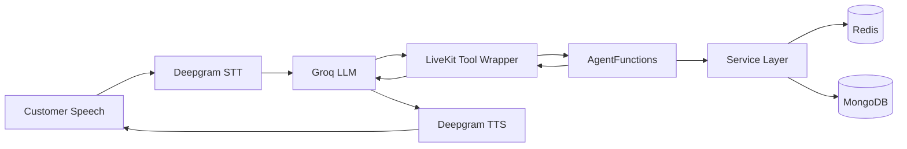
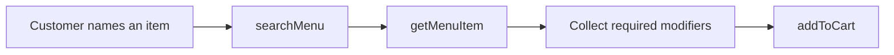
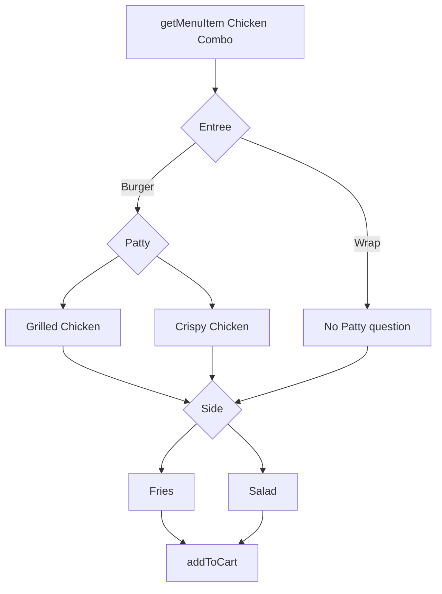
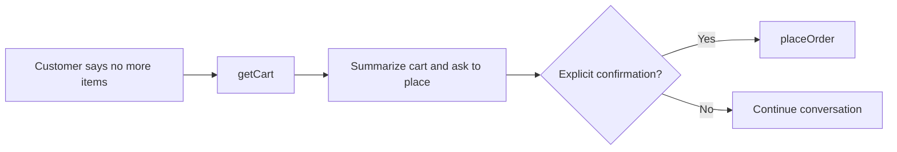

# Agent Tools

## 1. Overview

The restaurant voice agent uses structured tools to read authoritative menu data, validate modifiers, manage the Redis cart, and place MongoDB orders.

The LLM does not calculate prices or directly access MongoDB or Redis.



The current ordering tools are:

| Tool          | Purpose                                      |
| ------------- | -------------------------------------------- |
| `listMenu`    | Return available menu names, IDs, and prices |
| `searchMenu`  | Search menu items using customer wording     |
| `getMenuItem` | Return one item's modifier tree              |
| `getCart`     | Return current cart items and totals         |
| `addToCart`   | Validate and add an item                     |
| `placeOrder`  | Place the order after explicit confirmation  |

`getRestaurant` is used internally during startup and analytics. Cart-removal, cart-clearing, and session-closing functions exist in `AgentFunctions`, but they are not required as public LLM tools in the current ordering flow.

---

## 2. Internal Results vs. LLM-Facing Results

`AgentFunctions` returns this internal shape:

```ts
interface AgentFunctionResult<T = unknown> {
  success: boolean;
  message: string;
  data?: T;
}
```

The LiveKit tool wrapper projects successful results into smaller LLM-facing payloads. This keeps business logic unchanged while reducing prompt tokens.

Example internal result:

```json
{
  "success": true,
  "message": "2 menu items are available.",
  "data": {
    "items": []
  }
}
```

Example LLM-facing result:

```json
{
  "success": true,
  "items": []
}
```

Failure results are preserved because they may contain validation details such as `missingModifierGroups`.

---

## 3. Compact Tool Shorthand

Successful tool outputs use compact keys:

| Key     | Meaning                     |
| ------- | --------------------------- |
| `n`     | Name                        |
| `g`     | Modifier group name         |
| `opts`  | Available options           |
| `req`   | Required                    |
| `min`   | Minimum selections          |
| `max`   | Maximum selections          |
| `multi` | Multiple selections allowed |
| `p`     | Additional price            |
| `mods`  | Nested modifier groups      |
| `qty`   | Quantity                    |
| `cat`   | Category when included      |

Nested `mods` belong only to the exact parent option containing them.

---

## 4. `listMenu`

### Purpose

Return all available menu items in a minimal form.

### Input

```json
{}
```

### LLM-facing success output

```json
{
  "success": true,
  "items": [
    {
      "id": "menu-object-id",
      "n": "Margherita Pizza",
      "price": 299
    },
    {
      "id": "menu-object-id",
      "n": "Chicken Combo",
      "price": 399
    }
  ]
}
```

### Behavior

- Reads only available items
- Does not return full modifier trees
- Gives the model enough data to speak the menu and select an item ID
- Prices are rupees: `299` means `₹299`

---

## 5. `searchMenu`

### Purpose

Search available menu items using the customer's wording.

### Input

```json
{
  "query": "chicken combo"
}
```

### LLM-facing success output

```json
{
  "success": true,
  "items": [
    {
      "id": "menu-object-id",
      "n": "Chicken Combo",
      "price": 399
    }
  ]
}
```

### Behavior

- Uses the menu search service
- Returns lightweight matches
- Does not add anything to the cart
- The returned ID can be passed to `getMenuItem`

---

## 6. `getMenuItem`

### Purpose

Return authoritative details and the complete recursive modifier structure for one item.

### Input

```json
{
  "menuId": "menu-object-id"
}
```

`AgentFunctions.getMenuItem` can resolve either a MongoDB ID or an item name. The tool should normally use a returned menu ID.

### LLM-facing success output

```json
{
  "success": true,
  "id": "menu-object-id",
  "n": "Chicken Combo",
  "price": 399,
  "mods": [
    {
      "g": "Entree",
      "req": true,
      "multi": false,
      "min": 1,
      "max": 1,
      "opts": [
        {
          "n": "Burger",
          "p": 0,
          "mods": [
            {
              "g": "Patty",
              "req": true,
              "multi": false,
              "min": 1,
              "max": 1,
              "opts": [
                {
                  "n": "Grilled Chicken",
                  "p": 0,
                  "mods": []
                },
                {
                  "n": "Crispy Chicken",
                  "p": 30,
                  "mods": []
                }
              ]
            }
          ]
        },
        {
          "n": "Wrap",
          "p": 0,
          "mods": []
        }
      ]
    },
    {
      "g": "Side",
      "req": true,
      "multi": false,
      "min": 1,
      "max": 1,
      "opts": [
        {
          "n": "Fries",
          "p": 0,
          "mods": []
        },
        {
          "n": "Salad",
          "p": 20,
          "mods": []
        }
      ]
    }
  ]
}
```

### Nested-modifier behavior

For the Chicken Combo:

```text
Entree
├── Burger
│   └── Patty
│       ├── Grilled Chicken
│       └── Crispy Chicken
└── Wrap

Side
├── Fries
└── Salad
```

Rules:

- Ask `Patty` only when `Burger` is selected
- Do not ask for `Patty` when `Wrap` is selected
- Collect every required top-level group
- Collect every required nested group belonging to a selected parent option
- Use exact group and option names

---

## 7. `addToCart`

### Purpose

Validate the item, resolve official modifier data, calculate authoritative prices, and add the item to the active Redis cart.

### Input

```json
{
  "menuId": "menu-object-id",
  "quantity": 1,
  "selectedModifiers": [
    {
      "groupName": "Entree",
      "name": "Burger"
    },
    {
      "groupName": "Patty",
      "name": "Grilled Chicken"
    },
    {
      "groupName": "Side",
      "name": "Salad"
    }
  ]
}
```

### Input rules

- `quantity` should be a positive JSON number
- `selectedModifiers` should be an array
- Group and option names must exactly match `getMenuItem`
- The wrapper accepts numeric strings and stringified modifier arrays as a resilience fallback, but the model should send correct JSON types

### Validation

The function recursively validates:

- Menu item existence
- Item availability
- Positive whole-number quantity
- Required top-level modifiers
- Required nested modifiers for selected parent options
- Valid group names
- Valid option names
- Option availability
- Maximum selection limits

The model cannot supply trusted prices or modifier IDs. `AgentFunctions` resolves them from the menu document.

### LLM-facing success output

```json
{
  "success": true,
  "message": "1 Chicken Combo added to cart.",
  "total": 439.95
}
```

### Missing-modifier failure

Failure payloads retain the internal validation data:

```json
{
  "success": false,
  "message": "Ask the customer to select the required options before adding this item.",
  "data": {
    "requiresCustomerInput": true,
    "missingModifierGroups": [
      {
        "g": "Patty",
        "req": true,
        "multi": false,
        "min": 1,
        "max": 1,
        "opts": [
          {
            "n": "Grilled Chicken",
            "p": 0,
            "mods": []
          },
          {
            "n": "Crispy Chicken",
            "p": 30,
            "mods": []
          }
        ]
      }
    ]
  }
}
```

---

## 8. `getCart`

### Purpose

Return the latest Redis cart without allowing the LLM to calculate totals.

### Input

```json
{}
```

### Empty-cart output

```json
{
  "success": true,
  "items": [],
  "subtotal": 0,
  "tax": 0,
  "total": 0
}
```

### Cart output

```json
{
  "success": true,
  "items": [
    {
      "id": "cart-item-uuid",
      "n": "Chicken Combo",
      "qty": 1,
      "mods": [
        {
          "g": "Entree",
          "n": "Burger",
          "p": 0
        },
        {
          "g": "Patty",
          "n": "Grilled Chicken",
          "p": 0
        },
        {
          "g": "Side",
          "n": "Salad",
          "p": 20
        }
      ],
      "total": 419
    }
  ],
  "subtotal": 419,
  "tax": 20.95,
  "total": 439.95
}
```

### Behavior

- Reads current cart state from Redis
- Returns backend-calculated subtotal, tax, and total
- Uses compact cart item and modifier keys
- Should be used before a final cart summary
- Is not needed merely to repeat the total already returned by a successful `addToCart`

---

## 9. `placeOrder`

### Purpose

Create a persistent MongoDB order after explicit confirmation.

### Input

```json
{
  "confirmed": true
}
```

### Validation

The function checks:

- `confirmed` is exactly `true`
- The cart is not empty
- The restaurant is open
- Customer details are present in the POC session
- Order creation succeeds

### LLM-facing success output

```json
{
  "success": true,
  "message": "The order was placed successfully.",
  "orderNumber": "ORD-1784804519497-3FE8F8",
  "total": 439.95
}
```

### Failure example

```json
{
  "success": false,
  "message": "The cart is empty. Add an item before placing the order."
}
```

### Side effects

After success:

- Order is stored in MongoDB
- Order analytics are updated
- Redis cart is cleared
- Session state becomes `order_placed`

The agent may say the order is confirmed only after `placeOrder` returns `success: true`.

---

## 10. Internal `AgentFunctions`

The service-facing class contains these functions:

| Function         | Role                                                         |
| ---------------- | ------------------------------------------------------------ |
| `getRestaurant`  | Load restaurant name, contact details, hours, and open state |
| `listMenu`       | Read available menu summaries                                |
| `getMenuItem`    | Resolve item by ID or name                                   |
| `searchMenu`     | Search menu documents                                        |
| `getCart`        | Read the current Redis cart                                  |
| `addToCart`      | Recursively validate and add an item                         |
| `removeFromCart` | Remove a cart item by `cartItemId`                           |
| `clearCart`      | Clear the active cart                                        |
| `placeOrder`     | Validate confirmation and create the order                   |
| `endSession`     | Close the Redis session                                      |

Not every internal function is exposed to the LLM.

---

## 11. Tool Safety and Analytics

Every internal action runs through `executeSafely`.

It:

1. Starts a latency timer
2. Executes the service action
3. Records the tool name, latency, and success status
4. Records failures in analytics
5. Converts thrown errors into `success: false`
6. Prevents a tool error from crashing the agent worker

Conceptual signature:

```ts
private async executeSafely(
  toolName: string,
  action: () => Promise<AgentFunctionResult>,
): Promise<AgentFunctionResult>
```

Tool analytics include:

```text
sessionId
toolName
latencyMs
success
createdAt
```

---

## 12. Recommended Ordering Flow

### Full menu request


### Named item request



### Nested Chicken Combo



### Final confirmation



`No` to “Would you like anything else?” means no more items. It is not final order confirmation.

---

## 13. Design Decisions

### Compact successful results

The wrapper removes fields that are not needed for the next LLM decision. This reduces repeated prompt tokens while leaving backend business logic unchanged.

### Full failure details

Validation failures remain detailed so the model can ask the exact missing question.

### Recursive modifier validation

Nested required groups are evaluated only under selected parent options.

### Deterministic totals

All prices, tax, and totals come from services, not LLM reasoning.

### Redis session isolation

Every call uses its own session ID and cart, preventing callers from sharing state.

---

## 14. Current Limitations

- Conversation history still contributes most of the prompt-token growth
- LLM provider TPM limits can interrupt long or tool-heavy sessions
- STT endpointing can mishear short modifier answers
- Cart removal and editing are not central public tools in the current voice flow
- Payments, delivery addresses, SMS, and email confirmation are outside the completed POC flow
