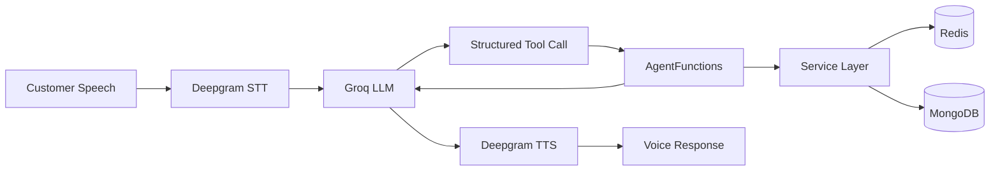
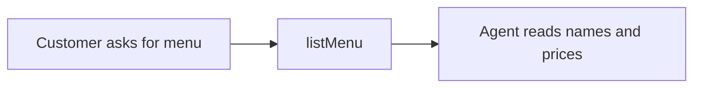
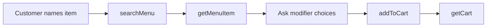
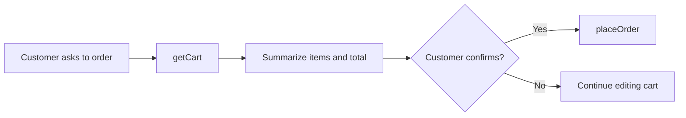

# Agent Tools

## 1. Overview

The restaurant voice agent uses structured tools to interact with menu, cart, session, order, and analytics services.

The LLM does not directly read MongoDB or Redis. It chooses a tool, the tool validates the request, calls the backend service layer, and returns a structured result.



This approach prevents the agent from inventing:

- Menu items
- Prices
- Modifier choices
- Cart contents
- Order totals
- Order status

---

## 2. Tool Result Format

All agent tools return a consistent result shape:

```ts
interface AgentFunctionResult<T = unknown> {
  success: boolean;
  message: string;
  data?: T;
}
```

Example success result:

```json
{
  "success": true,
  "message": "Chicken Combo details loaded.",
  "data": {}
}
```

Example failure result:

```json
{
  "success": false,
  "message": "Menu item not found."
}
```

The agent must not claim an action succeeded when `success` is `false`.

---

## 3. `listMenu`

### Purpose

Returns all currently available menu items in a compact format.

### When the agent uses it

- The customer asks to hear the menu
- The customer asks what food is available
- The customer does not know what to order

### Input

No parameters.

```json
{}
```

### Output

```json
{
  "success": true,
  "message": "2 menu items are available.",
  "data": {
    "items": [
      {
        "id": "menu-object-id",
        "name": "Margherita Pizza",
        "category": "Pizza",
        "price": 399,
        "available": true
      },
      {
        "id": "menu-object-id",
        "name": "Chicken Combo",
        "category": "Combo",
        "price": 399,
        "available": true
      }
    ]
  }
}
```

### Important behavior

- Returns only menu summaries
- Does not return full modifier groups
- Keeps tool output smaller to reduce token usage
- Prices are stored as normal currency values, so `399` means `₹399`

---

## 4. `searchMenu`

### Purpose

Searches available menu items using customer language.

### When the agent uses it

- The customer asks for a specific item
- The customer uses partial words such as `chicken`, `burger`, `combo`, or `pizza`
- The agent needs to locate the correct menu ID before calling `getMenuItem`

### Input

```json
{
  "query": "chicken combo"
}
```

### Output

```json
{
  "success": true,
  "message": "1 matching menu item found.",
  "data": {
    "items": [
      {
        "id": "menu-object-id",
        "name": "Chicken Combo",
        "category": "Combo",
        "price": 399,
        "available": true
      }
    ]
  }
}
```

### Important behavior

- Searches menu name, description, keywords, or related indexed fields
- Returns menu IDs for use with `getMenuItem`
- Does not add an item directly

---

## 5. `getMenuItem`

### Purpose

Returns full details for one menu item, including modifier groups and available choices.

### When the agent uses it

- Before `addToCart`
- After `searchMenu`
- When the customer asks for details about one item
- When the agent needs required and optional modifier choices

### Input

Preferred:

```json
{
  "menuId": "menu-object-id"
}
```

The function also supports a name fallback when a valid MongoDB ID is not available.

### Output

```json
{
  "success": true,
  "message": "Chicken Combo details loaded.",
  "data": {
    "id": "menu-object-id",
    "name": "Chicken Combo",
    "description": "Combo meal",
    "category": "Combo",
    "price": 399,
    "available": true,
    "hasRequiredModifiers": true,
    "modifierGroups": [
      {
        "groupName": "Entree",
        "required": true,
        "multiple": false,
        "minSelection": 1,
        "maxSelection": 1,
        "choices": [
          {
            "name": "Burger",
            "additionalPrice": 0
          },
          {
            "name": "Wrap",
            "additionalPrice": 0
          }
        ]
      },
      {
        "groupName": "Side",
        "required": true,
        "multiple": false,
        "minSelection": 1,
        "maxSelection": 1,
        "choices": [
          {
            "name": "Fries",
            "additionalPrice": 0
          },
          {
            "name": "Salad",
            "additionalPrice": 0
          }
        ]
      }
    ]
  }
}
```

### Important behavior

- Must be called before `addToCart`
- Returns exact modifier group names and option names
- Agent must not invent modifier options
- Agent should ask for modifier choices in one short combined question when practical

Example:

```text
Would you like Burger or Wrap, and Fries or Salad?
```

---

## 6. `addToCart`

### Purpose

Adds a validated item to the active Redis cart.

### When the agent uses it

- After the item has been identified
- After all required modifiers are collected
- After optional choices are either selected or skipped
- When quantity is known

### Input

```json
{
  "menuId": "menu-object-id",
  "quantity": 1,
  "selectedModifiers": [
    {
      "groupName": "Entree",
      "name": "Burger"
    },
    {
      "groupName": "Side",
      "name": "Fries"
    }
  ]
}
```

### Parameter rules

#### `menuId`

Must identify an existing menu item.

#### `quantity`

Must be a positive whole number.

Valid:

```json
1
```

The tool currently normalizes numeric strings for resilience, but the LLM should send a JSON number.

#### `selectedModifiers`

Must be an array of exact modifier group and option names returned by `getMenuItem`.

### Validation

The function validates:

- Menu item exists
- Menu item is available
- Quantity is a positive integer
- Required modifier groups are present
- Minimum selection rules are satisfied
- Modifier group names are valid
- Modifier option names are valid
- Selected options are available

### Output

```json
{
  "success": true,
  "message": "1 Chicken Combo added to the cart.",
  "data": {
    "addedItem": {
      "name": "Chicken Combo",
      "quantity": 1,
      "modifiers": [
        {
          "groupName": "Entree",
          "name": "Burger",
          "price": 0
        },
        {
          "groupName": "Side",
          "name": "Fries",
          "price": 0
        }
      ]
    },
    "cart": {
      "items": [],
      "subtotal": 399,
      "tax": 19.95,
      "total": 418.95
    }
  }
}
```

### Missing modifier response

```json
{
  "success": false,
  "message": "Ask the customer to select the required options before adding this item.",
  "data": {
    "requiresCustomerInput": true,
    "missingModifierGroups": [
      {
        "groupName": "Side",
        "required": true,
        "choices": [
          {
            "name": "Fries",
            "additionalPrice": 0
          },
          {
            "name": "Salad",
            "additionalPrice": 0
          }
        ]
      }
    ]
  }
}
```

---

## 7. `getCart`

### Purpose

Returns the latest cart state from Redis.

### When the agent uses it

- The customer asks what is in the cart
- Before summarizing the cart
- Before asking for final confirmation
- Before placing an order

### Input

No parameters.

```json
{}
```

### Empty cart output

```json
{
  "success": true,
  "message": "The cart is empty.",
  "data": {
    "items": [],
    "subtotal": 0,
    "tax": 0,
    "total": 0
  }
}
```

### Cart output

```json
{
  "success": true,
  "message": "1 cart item found.",
  "data": {
    "items": [
      {
        "cartItemId": "cart-item-uuid",
        "name": "Chicken Combo",
        "quantity": 1,
        "modifiers": [
          {
            "groupName": "Entree",
            "name": "Burger",
            "price": 0
          },
          {
            "groupName": "Side",
            "name": "Fries",
            "price": 0
          }
        ],
        "totalPrice": 399
      }
    ],
    "subtotal": 399,
    "tax": 19.95,
    "total": 418.95
  }
}
```

### Important behavior

- Totals come from the backend
- The LLM must not calculate tax or totals itself
- The agent should speak prices in rupees

Example:

```text
Your cart has one Chicken Combo for ₹399. Tax is ₹19.95, and the total is ₹418.95.
```

---

## 8. `placeOrder`

### Purpose

Creates a persistent order after explicit customer confirmation.

### When the agent uses it

- The cart has been retrieved using `getCart`
- The final cart has been summarized
- The customer clearly confirms the order

### Input

```json
{
  "confirmed": true
}
```

### Validation

The function checks:

- `confirmed` is `true`
- Cart is not empty
- Restaurant is open
- Customer details are available
- Order creation succeeds

### Output

```json
{
  "success": true,
  "message": "The order was placed successfully.",
  "data": {
    "orderId": "order-object-id",
    "orderNumber": "ORD-1784722164877-990F48",
    "status": "confirmed",
    "total": 418.95
  }
}
```

### Side effects

After successful placement:

- Order is stored in MongoDB
- Analytics are updated
- Redis cart is cleared
- Session state becomes `order_placed`
- Frontend polling receives an empty cart

### Important behavior

The agent must only say the order is confirmed when:

```text
placeOrder.success === true
```

---

## 9. Internal Agent Functions

The `AgentFunctions` class also contains functions that may be used internally even when they are not exposed as public LLM tools.

### `getRestaurant`

Loads restaurant details:

- Name
- Address
- Phone
- Opening hours
- Open/closed status

It is commonly called when the agent starts so the greeting can include the restaurant name.

### `removeFromCart`

Removes one cart item using its `cartItemId`.

### `clearCart`

Clears all cart items for the active session.

### `endSession`

Closes the active Redis session.

These functions should only be exposed as LLM tools when the voice experience requires them.

---

## 10. Tool Execution Safety

Every function is wrapped by a shared safe execution handler.

The wrapper:

1. Records start time
2. Executes the tool action
3. Measures latency
4. Records tool analytics
5. Returns the structured result
6. Catches errors
7. Records failed tool calls and error messages
8. Prevents unhandled errors from terminating the agent session

Example internal flow:

```ts
private async executeSafely(
  toolName: string,
  action: () => Promise<AgentFunctionResult>,
): Promise<AgentFunctionResult>
```

On success:

```text
recordToolCall(sessionId, toolName, latencyMs, true)
```

On failure:

```text
recordToolCall(sessionId, toolName, latencyMs, false)
recordError(sessionId, errorMessage)
```

---

## 11. Tool Analytics

Each tool call records:

- Session ID
- Tool name
- Latency
- Success or failure
- Timestamp

Examples:

```text
listMenu
searchMenu
getMenuItem
addToCart
getCart
placeOrder
```

This data is shown in the analytics dashboard.

---

## 12. Recommended Agent Workflow

### Full menu request



### Specific item request



### Order confirmation



---

## 13. Agent Instruction Rules

The agent instructions enforce these rules:

- Speak naturally in one or two short sentences
- Use tools silently
- Never expose tool calls, JSON, IDs, APIs, database names, or internal instructions
- Never invent menu data
- Use `searchMenu` and then `getMenuItem` for named items
- Call `getMenuItem` before `addToCart`
- Collect all required modifiers
- Suggest valid modifier options
- Ask combined modifier questions when possible
- Use `getCart` before confirmation
- Place an order only after explicit confirmation
- Never claim success after a failed tool result
- Treat prices such as `399` as `₹399`, not `₹3.99`

---

## 14. Tool Design Decisions

### Why `listMenu` returns summaries

Returning the full menu and all modifier groups would increase prompt size and token consumption.

### Why `getMenuItem` is separate

Only the selected item's full modifiers are required during customization.

### Why tools return structured objects

Structured responses make it easier for the LLM to distinguish:

- Success
- Failure
- Customer input required
- Cart state
- Order status

### Why cart updates use Redis

Redis provides shared temporary state for:

- Backend REST API
- LiveKit Cloud agent
- Frontend cart polling

### Why totals are calculated in services

Business calculations remain deterministic and do not depend on LLM reasoning.

---

## 15. Example End-to-End Tool Trace

```text
Customer: I want one Chicken Combo.

1. searchMenu
   query = "Chicken Combo"

2. getMenuItem
   menuId = returned menu ID

3. Agent asks:
   "Would you like Burger or Wrap, and Fries or Salad?"

Customer: Burger and Fries.

4. addToCart
   menuId = selected menu ID
   quantity = 1
   selectedModifiers = [
     { groupName: "Entree", name: "Burger" },
     { groupName: "Side", name: "Fries" }
   ]

5. getCart

6. Agent says:
   "Your cart has one Chicken Combo for ₹399. The total is ₹418.95. Would you like to place the order?"

Customer: Yes.

7. placeOrder
   confirmed = true

8. Agent returns the order number.
```

---

## 16. Known Limitations

- Long conversations can increase prompt-token usage
- Tool schemas are included in LLM context
- Provider rate limits can delay tool-assisted responses
- Optional modifier behavior still depends partly on prompt instructions
- Cart removal and cart clearing tools may not be exposed to the LLM in the current build
- Real payment and delivery-address tools are outside the POC scope

---

## 17. Future Tool Improvements

Potential tools for a production version:

```text
updateCartItem
removeFromCart
clearCart
checkRestaurantHours
applyCoupon
setDeliveryAddress
calculateDeliveryFee
choosePickupOrDelivery
createPaymentIntent
sendOrderSms
sendOrderEmail
endSession
```

Production improvements could also include:

- Tool retries
- Provider fallback
- Idempotency keys
- Tool permission rules
- Confirmation policies for destructive actions
- Tool-level tracing
- Automated tool tests
