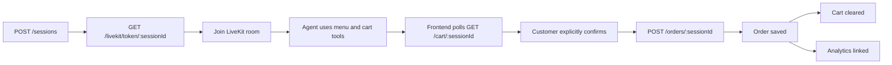

# API Routes

## 1. Base URL

### Local development

```text
http://localhost:5000/api/v1
```

### Deployed backend

```text
https://voice-agent-poc-f2tv.onrender.com/api/v1
```

All routes below are relative to `/api/v1`.

---

## 2. Response Format

Successful HTTP responses use a `success` flag and a `data` payload:

```json
{
  "success": true,
  "data": {}
}
```

Failed HTTP responses use a `success` flag and a message:

```json
{
  "success": false,
  "message": "Error message"
}
```

The exact fields inside `data` depend on the route.

---

## 3. Route Summary

| Area       | Method   | Route                                |
| ---------- | -------- | ------------------------------------ |
| Health     | `GET`    | `/health`                            |
| Sessions   | `POST`   | `/sessions`                          |
| Sessions   | `GET`    | `/sessions/:sessionId`               |
| LiveKit    | `GET`    | `/livekit/token/:sessionId`          |
| Restaurant | `GET`    | `/restaurants`                       |
| Menu       | `GET`    | `/menu`                              |
| Menu       | `GET`    | `/menu/search?query=...`             |
| Menu       | `GET`    | `/menu/:menuId`                      |
| Cart       | `GET`    | `/cart/:sessionId`                   |
| Cart       | `POST`   | `/cart/:sessionId/items`             |
| Cart       | `DELETE` | `/cart/:sessionId/items/:cartItemId` |
| Cart       | `DELETE` | `/cart/:sessionId`                   |
| Orders     | `POST`   | `/orders/:sessionId`                 |
| Orders     | `GET`    | `/orders`                            |
| Orders     | `GET`    | `/orders/:orderId`                   |
| Orders     | `PATCH`  | `/orders/:orderId/status`            |
| Analytics  | `POST`   | `/analytics/:sessionId/start`        |
| Analytics  | `POST`   | `/analytics/:sessionId/turn`         |
| Analytics  | `POST`   | `/analytics/:sessionId/end`          |
| Analytics  | `GET`    | `/analytics/summary`                 |
| Analytics  | `GET`    | `/analytics`                         |
| Analytics  | `GET`    | `/analytics/:sessionId`              |
| Call logs  | `GET`    | `/call-logs`                         |
| Call logs  | `GET`    | `/call-logs/:sessionId`              |

---

## 4. Health

### Check backend status

```http
GET /health
```

Example response:

```json
{
  "success": true,
  "message": "Server is healthy"
}
```

---

## 5. Sessions

A session represents one restaurant-ordering conversation. The same `sessionId` is used by the frontend, Redis cart, LiveKit room, and voice agent.

### Create a session

```http
POST /sessions
```

Example response:

```json
{
  "success": true,
  "data": {
    "sessionId": "cbcdec12-ec54-4fa0-8725-1d52c86d285a",
    "currentState": "active"
  }
}
```

Creating a session initializes:

- A unique session ID
- Session state
- An empty Redis cart
- Customer metadata used by the POC

### Get a session

```http
GET /sessions/:sessionId
```

Example response:

```json
{
  "success": true,
  "data": {
    "sessionId": "cbcdec12-ec54-4fa0-8725-1d52c86d285a",
    "currentState": "active",
    "customer": {
      "name": "Mohit",
      "phone": "1234567890",
      "email": "mohit@example.com"
    },
    "cart": {
      "items": [],
      "subtotal": 0,
      "tax": 0,
      "total": 0
    }
  }
}
```

Current session states are:

```text
active
order_placed
closed
```

---

## 6. LiveKit

### Generate a participant token

```http
GET /livekit/token/:sessionId
```

The route creates a short-lived token for the LiveKit room associated with the session.

Example response:

```json
{
  "success": true,
  "data": {
    "token": "livekit-participant-token",
    "url": "wss://voice-agent-poc-vx5xjz20.livekit.cloud",
    "room": "cbcdec12-ec54-4fa0-8725-1d52c86d285a"
  }
}
```

The frontend connects with the returned URL and token:

```ts
await room.connect(url, token);
```

---

## 7. Restaurant

### Get restaurant details

```http
GET /restaurants
```

Example response:

```json
{
  "success": true,
  "data": {
    "_id": "restaurant-object-id",
    "name": "Food Palace",
    "phone": "0000000000",
    "address": "Restaurant address",
    "isOpen": true,
    "openingHours": {}
  }
}
```

Restaurant-open validation is also performed internally before order placement.

---

## 8. Menu

Menu documents are stored in MongoDB. Only available menu items are offered by the voice agent.

### Get all menu items

```http
GET /menu
```

Example response:

```json
{
  "success": true,
  "data": [
    {
      "_id": "menu-object-id",
      "restaurantId": "restaurant-object-id",
      "name": "Margherita Pizza",
      "description": "Classic cheese pizza",
      "basePrice": 299,
      "category": "Pizza",
      "available": true,
      "modifierGroups": []
    },
    {
      "_id": "menu-object-id",
      "restaurantId": "restaurant-object-id",
      "name": "Chicken Combo",
      "description": "Chicken entree with a side",
      "basePrice": 399,
      "category": "Combo",
      "available": true,
      "modifierGroups": []
    }
  ]
}
```

### Search the menu

```http
GET /menu/search?query=chicken
```

Example response:

```json
{
  "success": true,
  "data": [
    {
      "_id": "menu-object-id",
      "name": "Chicken Combo",
      "basePrice": 399,
      "category": "Combo",
      "available": true
    }
  ]
}
```

Search uses menu fields such as name, description, and keywords.

### Get one menu item

```http
GET /menu/:menuId
```

Example response showing nested modifiers:

```json
{
  "success": true,
  "data": {
    "_id": "menu-object-id",
    "name": "Chicken Combo",
    "basePrice": 399,
    "category": "Combo",
    "available": true,
    "modifierGroups": [
      {
        "name": "Entree",
        "required": true,
        "multiple": false,
        "minSelection": 1,
        "maxSelection": 1,
        "options": [
          {
            "_id": "modifier-object-id",
            "name": "Burger",
            "price": 0,
            "available": true,
            "modifierGroups": [
              {
                "name": "Patty",
                "required": true,
                "multiple": false,
                "minSelection": 1,
                "maxSelection": 1,
                "options": [
                  {
                    "_id": "modifier-object-id",
                    "name": "Grilled Chicken",
                    "price": 0,
                    "available": true,
                    "modifierGroups": []
                  },
                  {
                    "_id": "modifier-object-id",
                    "name": "Crispy Chicken",
                    "price": 30,
                    "available": true,
                    "modifierGroups": []
                  }
                ]
              }
            ]
          },
          {
            "_id": "modifier-object-id",
            "name": "Wrap",
            "price": 0,
            "available": true,
            "modifierGroups": []
          }
        ]
      },
      {
        "name": "Side",
        "required": true,
        "multiple": false,
        "minSelection": 1,
        "maxSelection": 1,
        "options": [
          {
            "_id": "modifier-object-id",
            "name": "Fries",
            "price": 0,
            "available": true,
            "modifierGroups": []
          },
          {
            "_id": "modifier-object-id",
            "name": "Salad",
            "price": 20,
            "available": true,
            "modifierGroups": []
          }
        ]
      }
    ]
  }
}
```

A nested modifier group applies only when its parent option is selected. For example, the `Patty` group applies to `Burger`, not to `Wrap`.

---

## 9. Cart

The cart is stored in Redis and scoped by `sessionId`.

### Get the cart

```http
GET /cart/:sessionId
```

Example response:

```json
{
  "success": true,
  "data": {
    "items": [
      {
        "cartItemId": "cart-item-uuid",
        "menuId": "menu-object-id",
        "itemName": "Chicken Combo",
        "quantity": 1,
        "basePrice": 399,
        "selectedModifiers": [
          {
            "modifierOptionId": "modifier-object-id",
            "groupName": "Entree",
            "optionName": "Burger",
            "name": "Burger",
            "price": 0
          },
          {
            "modifierOptionId": "modifier-object-id",
            "groupName": "Patty",
            "optionName": "Grilled Chicken",
            "name": "Grilled Chicken",
            "price": 0
          },
          {
            "modifierOptionId": "modifier-object-id",
            "groupName": "Side",
            "optionName": "Salad",
            "name": "Salad",
            "price": 20
          }
        ],
        "totalPrice": 419
      }
    ],
    "subtotal": 419,
    "tax": 20.95,
    "total": 439.95
  }
}
```

### Add an item

```http
POST /cart/:sessionId/items
```

Example request:

```json
{
  "menuId": "menu-object-id",
  "quantity": 1,
  "selectedModifiers": [
    {
      "groupName": "Entree",
      "name": "Burger"
    },
    {
      "groupName": "Patty",
      "name": "Grilled Chicken"
    },
    {
      "groupName": "Side",
      "name": "Salad"
    }
  ]
}
```

The service validates:

- The menu item exists
- The menu item is available
- Quantity is a positive integer
- Required top-level modifiers are selected
- Required nested modifiers are selected only for selected parent options
- Group and option names are valid
- Minimum and maximum selection rules are respected
- Prices are loaded from the menu document rather than trusted from the client

### Remove an item

```http
DELETE /cart/:sessionId/items/:cartItemId
```

### Clear the cart

```http
DELETE /cart/:sessionId
```

Example response:

```json
{
  "success": true,
  "data": {
    "items": [],
    "subtotal": 0,
    "tax": 0,
    "total": 0
  }
}
```

---

## 10. Orders

Orders are persisted in MongoDB.

### Place an order

```http
POST /orders/:sessionId
```

Example request:

```json
{
  "confirmed": true
}
```

Example response:

```json
{
  "success": true,
  "data": {
    "_id": "order-object-id",
    "sessionId": "cbcdec12-ec54-4fa0-8725-1d52c86d285a",
    "orderNumber": "ORD-1784804519497-3FE8F8",
    "orderStatus": "confirmed",
    "subtotal": 419,
    "tax": 20.95,
    "total": 439.95
  }
}
```

After successful placement:

- The order is saved in MongoDB
- The analytics record is linked to the order
- The Redis cart is cleared
- The session state becomes `order_placed`

### Get all orders

```http
GET /orders
```

### Get one order

```http
GET /orders/:orderId
```

### Update order status

```http
PATCH /orders/:orderId/status
```

Example request:

```json
{
  "status": "preparing"
}
```

Supported order states are defined by the Order model. The confirmed ordering flow creates an order with a confirmed status.

---

## 11. Analytics

Analytics are stored per voice session.

Tracked values include:

- Call duration
- User and assistant turns
- Prompt, completion, and total tokens
- Cart updates
- Tool calls and tool latency
- LLM usage events
- First-response and average latency
- Errors
- Order placement

### Start analytics

```http
POST /analytics/:sessionId/start
```

### Record a turn

```http
POST /analytics/:sessionId/turn
```

Example request:

```json
{
  "role": "user"
}
```

Valid roles:

```text
user
assistant
```

### End analytics

```http
POST /analytics/:sessionId/end
```

Example request:

```json
{
  "status": "completed"
}
```

### Get summary

```http
GET /analytics/summary
```

Example response:

```json
{
  "success": true,
  "data": {
    "totalCalls": 18,
    "completedCalls": 18,
    "failedCalls": 0,
    "ordersPlaced": 8,
    "totalTurns": 157,
    "totalToolCalls": 70,
    "totalCartUpdates": 19,
    "totalPromptTokens": 222209,
    "totalCompletionTokens": 8059,
    "totalTokens": 230268,
    "averageDurationSeconds": 97,
    "averageLatency": 432
  }
}
```

### Get all analytics sessions

```http
GET /analytics
```

### Get analytics by session

```http
GET /analytics/:sessionId
```

---

## 12. Call Logs

Call logs persist the voice-session timeline and transcript-related information used by the frontend.

### Get all call logs

```http
GET /call-logs
```

### Get a call log by session

```http
GET /call-logs/:sessionId
```

A call log may include:

- Session ID
- Restaurant ID
- Associated order ID
- Call status
- Transcript entries
- Start and end timestamps
- Duration

---

## 13. Session and Order Flow



---

## 14. Security Notes

- Never expose MongoDB, Redis, LiveKit secret, Groq, or Deepgram credentials to the frontend.
- The frontend may receive a short-lived LiveKit participant token.
- Do not commit `.env` or `secrets.env`.
- Rotate any credential that was committed or shared publicly.
