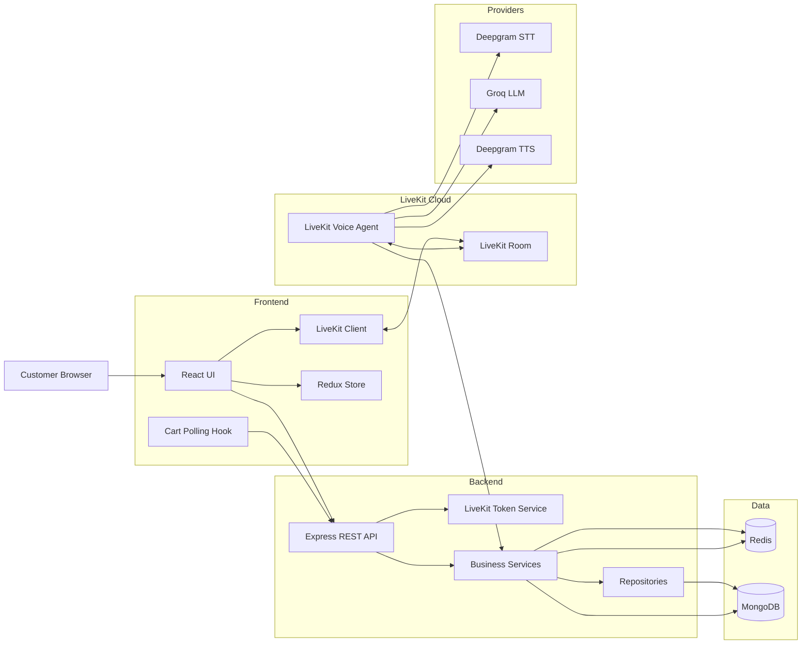
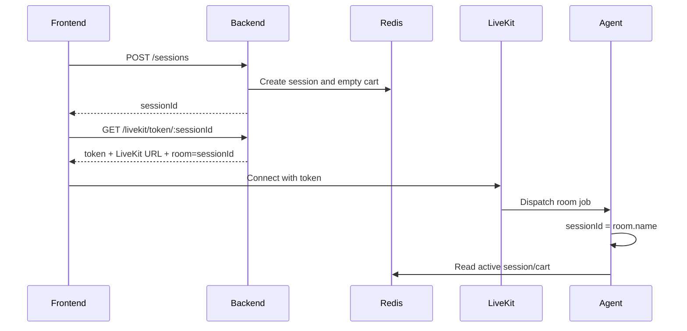
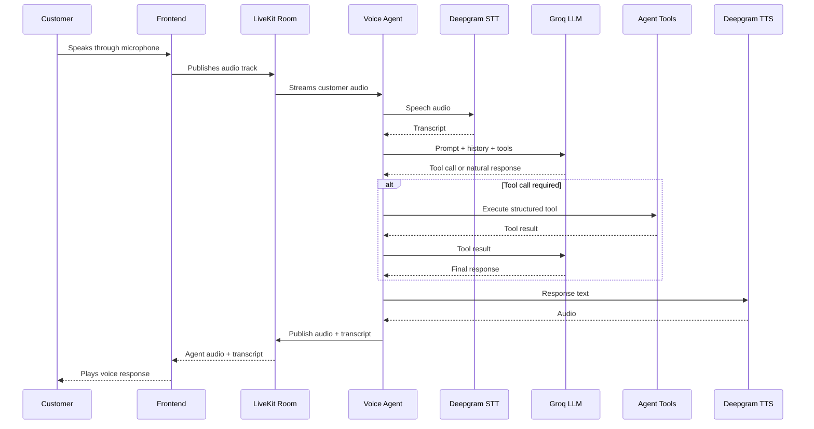
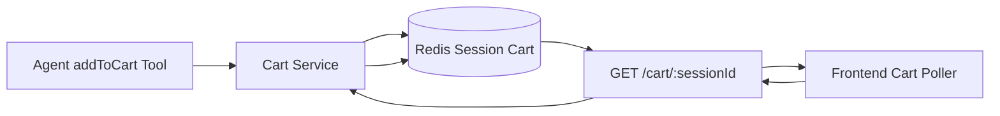
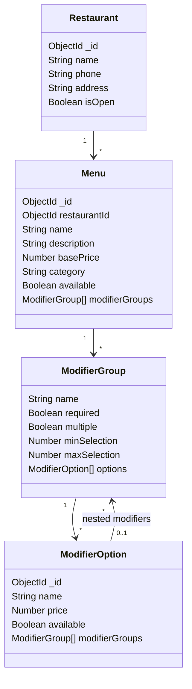
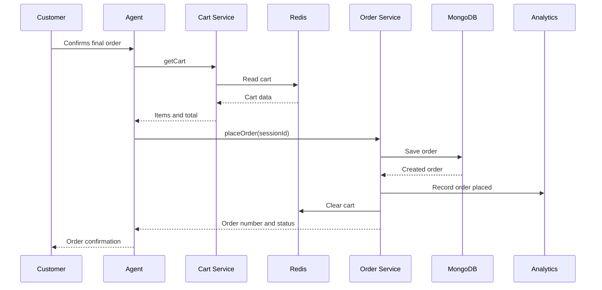
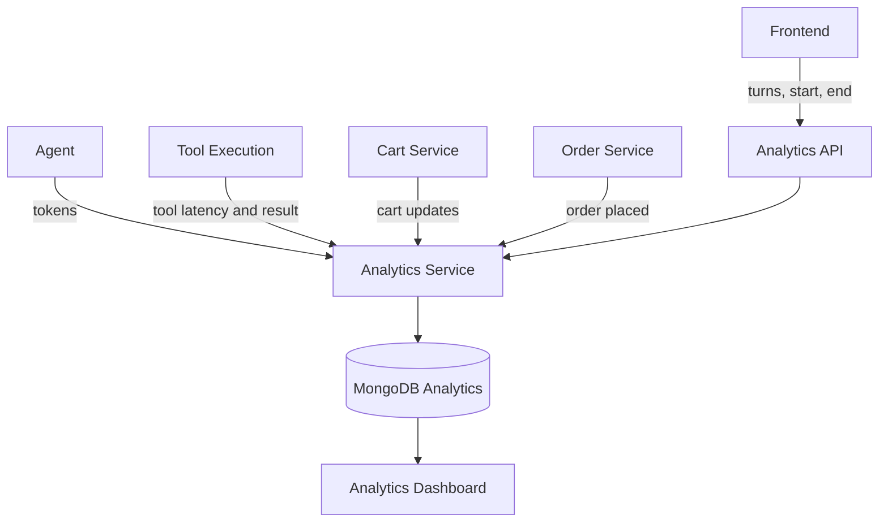
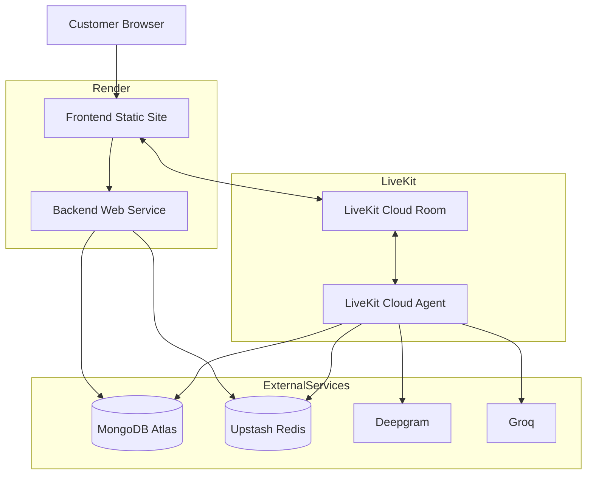

# Architecture

## 1. System Overview

The Voice Ordering Agent POC is a distributed full-stack application that allows a restaurant customer to interact with an AI ordering assistant through a browser-based voice call.

The system combines:

- A React frontend for voice interaction, live transcript, cart, orders, and analytics
- A Node.js/Express backend for REST APIs and LiveKit token generation
- A LiveKit Cloud agent for real-time voice orchestration
- Deepgram for speech-to-text and text-to-speech
- Groq for LLM reasoning and tool selection
- Redis for active sessions and carts
- MongoDB for persistent restaurant, menu, order, call-log, and analytics data

## 2. High-Level Architecture



## 3. Core Components

### 3.1 Frontend

The frontend is built with React, TypeScript, Vite, Redux Toolkit, Tailwind CSS, shadcn/ui, Axios, React Router, and the LiveKit client SDK.

Main responsibilities:

- Create a new ordering session
- Request a LiveKit token from the backend
- Connect the customer to the LiveKit room
- Publish microphone audio
- Play the agent's audio response
- Display caller and agent transcripts
- Poll the cart API for live cart updates
- Display menu, orders, analytics, and status information
- Keep the active session ID consistent across UI, cart polling, analytics, and LiveKit

Main frontend modules:

```text
src/
├── api/
│   ├── analytics.api.ts
│   ├── cart.api.ts
│   ├── menu.api.ts
│   ├── order.api.ts
│   ├── session.api.ts
│   └── callLog.api.ts
├── components/
│   ├── VoiceRecorder.tsx
│   ├── MenuItemCard.tsx
│   ├── StatusBar.tsx
│   └── AnalyticsPanel.tsx
├── hooks/
│   ├── useBootstrap.ts
│   └── useCartPolling.ts
├── redux/
│   ├── slices/
│   └── store.ts
├── pages/
└── types/
```

### 3.2 Backend API

The backend is built with Node.js, Express, TypeScript, Mongoose, Redis, and the LiveKit Server SDK.

Main responsibilities:

- Create and retrieve ordering sessions
- Generate LiveKit access tokens
- Serve restaurant and menu data
- Handle cart CRUD
- Place and retrieve orders
- Store and return analytics
- Expose REST endpoints to the frontend
- Share Redis and MongoDB data with the LiveKit agent

Main backend layers:

```text
Route
  ↓
Controller
  ↓
Service
  ↓
Repository
  ↓
MongoDB / Redis
```

### 3.3 LiveKit Voice Agent

The LiveKit agent runs as a cloud worker and receives a job when a customer joins a room.

Main responsibilities:

- Join the LiveKit room
- Use the room name as the ordering session ID
- Receive customer audio
- Convert speech to text using Deepgram
- Send conversation context and tool definitions to Groq
- Execute structured tools
- Convert the response to speech using Deepgram
- Publish agent audio and transcription back to the room
- Record token and tool analytics

The agent does not need a direct inbound HTTP call from the backend. It connects outbound to LiveKit Cloud and receives room jobs automatically.

## 4. Session Architecture

The session ID is the main correlation key across the entire application.



The following values must always match:

```text
Frontend Redux session ID
Frontend active session ID
LiveKit room name
LiveKit participant identity
Agent session ID
Redis session key
Cart polling session ID
Analytics session ID
```

## 5. Voice Pipeline



## 6. Agent Tool Architecture

The agent uses tools to prevent hallucinated menu items, prices, modifiers, and order state.

### `listMenu`

Returns available menu summaries:

```text
id
name
category
price
availability
```

### `searchMenu`

Searches the menu using customer language such as:

```text
chicken
burger
combo
pizza
drink
dessert
```

### `getMenuItem`

Returns one item's full details:

```text
id
name
description
category
base price
availability
required modifier groups
optional modifier groups
available choices
```

### `addToCart`

Validates:

- Menu item availability
- Positive integer quantity
- Required modifier groups
- Valid modifier options
- Modifier group limits

Then it updates the Redis cart.

### `getCart`

Returns:

- Items
- Quantity
- Selected modifiers
- Item totals
- Subtotal
- Tax
- Final total

### `placeOrder`

Places the order only after explicit customer confirmation.

It:

- Validates the cart
- Verifies restaurant availability
- Saves the order to MongoDB
- Updates analytics
- Clears the Redis cart
- Marks the session as order placed

## 7. Cart Architecture

The cart is stored in Redis because it is temporary, frequently updated, and shared between the backend and the agent.



Frontend cart updates use REST polling approximately every 1.5 seconds.

Reasons for using polling in this POC:

- Simple cross-process behavior
- No Socket.IO synchronization dependency
- Works across Render backend and LiveKit Cloud agent
- Easier debugging
- Same Redis cart is visible to both agent and frontend

## 8. Menu and Modifier Model



Nested modifiers are supported by allowing modifier options to contain additional modifier groups.

Example:

```text
Meal
└── Burger
    └── Patty Choice
        ├── Chicken
        └── Veg
```

## 9. Order Architecture



Orders are persisted in MongoDB because they must remain available after the call ends.

## 10. Data Storage Strategy

### Redis

Used for short-lived, frequently changing state:

- Active session
- Customer data during the call
- Current cart
- Session status
- Current ordering state

Example session state:

```json
{
  "sessionId": "uuid",
  "currentState": "active",
  "customer": {
    "name": "Customer",
    "phone": "0000000000",
    "email": "customer@example.com"
  },
  "cart": {
    "items": [],
    "subtotal": 0,
    "tax": 0,
    "total": 0
  }
}
```

### MongoDB

Used for persistent data:

- Restaurants
- Menus
- Orders
- Analytics
- Call logs, when enabled

## 11. Analytics Architecture

Analytics are collected from the frontend, backend services, and LiveKit agent.

Tracked metrics include:

- Total calls
- Completed calls
- Failed calls
- Orders placed
- Total turns
- User turns
- Agent turns
- Tool calls
- Cart updates
- Prompt tokens
- Completion tokens
- Total tokens
- Tool latency
- Call duration
- First-response latency where available
- LLM timing values where exposed by the provider



## 12. Frontend State Management

Redux Toolkit stores the main client state.

Main slices:

```text
sessionSlice
restaurantSlice
menuSlice
cartSlice
orderSlice
analyticsSlice
transcriptSlice
uiSlice
```

The `sessionSlice` stores:

```ts
interface SessionState {
  sessionId: string | null;
  status: "idle" | "creating" | "ready" | "error";
  error: string | null;
}
```

The application uses one source of truth for the active session. The session is created when a voice call starts or when a manual cart action requires one.

## 13. Deployment Architecture



### Frontend

```text
Platform: Render Static Site
Build: npm install && npm run build
Publish directory: dist
```

### Backend

```text
Platform: Render Web Service
Runtime: Node
Build: npm install && npm run build
Start: npm run server:start
```

### Agent

```text
Platform: LiveKit Cloud
Deployment command: lk agent deploy .
```

### Database

```text
MongoDB Atlas
```

### Session Store

```text
Upstash Redis
```

## 14. Security Boundaries

### Frontend-safe values

- LiveKit participant token
- LiveKit server URL
- Public backend API URL

### Backend or agent only

- LiveKit API key
- LiveKit API secret
- Groq API key
- Deepgram API key
- MongoDB URI
- Redis URL

The backend generates short-lived LiveKit participant tokens. Provider secrets are never sent to the frontend.

## 15. Reliability Considerations

### Session consistency

The session ID must not be created independently in multiple components.

Current approach:

- `VoiceRecorder` creates the voice session
- Manual menu/cart actions create a session only when none exists
- Bootstrap no longer auto-creates or restores stale sessions
- Cart polling receives the active session ID directly

### Provider failures

Possible provider failures:

- Deepgram `401`: invalid or expired API key
- Groq `429`: rate limit exceeded
- Render cold start: initial API delay
- Redis connectivity issue: cart/session unavailable
- MongoDB connectivity issue: menu/order/analytics unavailable

### Graceful cleanup

On disconnect:

- Microphone track is stopped
- Remote audio elements are removed
- LiveKit room disconnects
- Analytics session is ended
- Active frontend session state is cleared
- Cart polling stops
- Cart UI is cleared

## 16. Performance Considerations

Current optimization areas:

- Keep agent prompt concise
- Keep tool descriptions short
- Return menu summaries instead of full menu objects
- Return full modifiers only from `getMenuItem`
- Limit conversation history
- Use a faster Groq model for demo and low latency
- Keep Redis for active cart/session data
- Poll cart at a controlled interval
- Avoid duplicate frontend session creation

## 17. Known Architectural Limitations

- The POC uses browser voice instead of production SIP telephony
- Cart updates use polling instead of server push
- LLM history can increase token usage over long calls
- TTFT and LLM duration can remain zero when not exposed by provider events
- Third-party rate limits may affect the voice experience
- Payments are not included
- SMS and email confirmation may be stubbed rather than sent through production providers

## 18. Future Architecture Improvements

- SIP/phone number integration
- WebSocket or LiveKit data-channel cart updates
- Conversation memory trimming and summarization
- Provider fallback for STT, TTS, and LLM
- Background notification queue
- Real SMS and email providers
- Authentication and role-based admin access
- Multi-restaurant tenancy
- Distributed tracing and structured observability
- Retry and circuit-breaker patterns
- Automated integration and end-to-end tests
