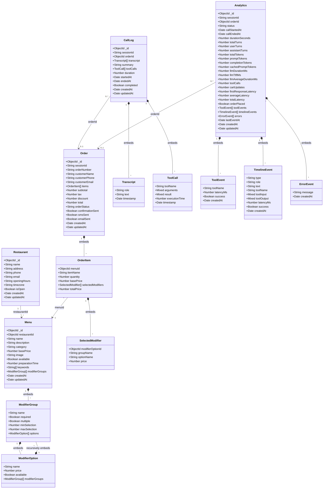

# Database Schema

This document is generated from the Mongoose model files in `models.zip`.

## Scope

The supplied source defines five MongoDB models:

- `Restaurant`
- `Menu`
- `Order`
- `CallLog`
- `Analytics`

Redis-backed session and cart structures are not included because no Session or Cart model was present in the supplied archive.

---

## Schema Diagram



---

# 1. Restaurant

MongoDB model name:

```text
Restaurant
```

## Fields

| Field | Type | Required | Default / Rules |
|---|---|---:|---|
| `name` | String | Yes | Trimmed |
| `address` | String | Yes | Trimmed |
| `phone` | String | Yes | Trimmed |
| `email` | String | Yes | Lowercased and trimmed |
| `openingHours` | String | Yes | — |
| `timezone` | String | No | `"Asia/Kolkata"` |
| `isOpen` | Boolean | No | `true` |
| `createdAt` | Date | Automatic | Added by timestamps |
| `updatedAt` | Date | Automatic | Added by timestamps |

## Declared index

```js
{ name: 1 }
```

---

# 2. Menu

MongoDB model name:

```text
Menu
```

## Fields

| Field | Type | Required | Default / Rules |
|---|---|---:|---|
| `restaurantId` | ObjectId | Yes | References `Restaurant`; indexed |
| `name` | String | Yes | Trimmed |
| `description` | String | No | Trimmed |
| `category` | String | Yes | Trimmed; indexed |
| `basePrice` | Number | Yes | Minimum `0` |
| `image` | String | No | — |
| `available` | Boolean | No | `true`; indexed |
| `preparationTime` | Number | No | `15` |
| `keywords` | String[] | No | Each value lowercased and trimmed |
| `modifierGroups` | ModifierGroup[] | No | Embedded recursive modifier tree |
| `createdAt` | Date | Automatic | Added by timestamps |
| `updatedAt` | Date | Automatic | Added by timestamps |

## ModifierGroup

Modifier groups are embedded subdocuments with `_id: false`.

| Field | Type | Required | Default / Rules |
|---|---|---:|---|
| `name` | String | Yes | Trimmed |
| `required` | Boolean | No | `false` |
| `multiple` | Boolean | No | `false` |
| `minSelection` | Number | No | `0` |
| `maxSelection` | Number | No | `1` |
| `options` | ModifierOption[] | No | Embedded options |

## ModifierOption

Modifier options are embedded subdocuments with `_id: false`.

| Field | Type | Required | Default / Rules |
|---|---|---:|---|
| `name` | String | Yes | Trimmed |
| `price` | Number | No | `0`; minimum `0` |
| `available` | Boolean | No | `true` |
| `modifierGroups` | ModifierGroup[] | No | Recursive nested groups |

## Recursive modifier example

```text
Chicken Combo
└── Entree
    ├── Burger
    │   └── Patty
    │       ├── Grilled Chicken
    │       └── Crispy Chicken
    └── Wrap
```

The recursion is implemented by adding `modifierGroups` to `modifierOptionSchema` after both embedded schemas are created.

## Declared indexes

```js
{ restaurantId: 1 }
{ category: 1 }
{ available: 1 }
{
  name: "text",
  description: "text",
  keywords: "text"
}
```

---

# 3. Order

MongoDB model name:

```text
Order
```

## Fields

| Field | Type | Required | Default / Rules |
|---|---|---:|---|
| `sessionId` | String | Yes | Indexed |
| `orderNumber` | String | Yes | Unique and indexed |
| `customerName` | String | Yes | Trimmed |
| `customerPhone` | String | Yes | Trimmed |
| `customerEmail` | String | Yes | Lowercased and trimmed |
| `items` | OrderItem[] | Yes | Embedded order items |
| `subtotal` | Number | Yes | Minimum `0` |
| `tax` | Number | No | `0`; minimum `0` |
| `discount` | Number | No | `0`; minimum `0` |
| `total` | Number | Yes | Minimum `0` |
| `orderStatus` | String | No | `"pending"`; indexed |
| `confirmationSent` | Boolean | No | `false` |
| `smsSent` | Boolean | No | `false` |
| `emailSent` | Boolean | No | `false` |
| `createdAt` | Date | Automatic | Added by timestamps |
| `updatedAt` | Date | Automatic | Added by timestamps |

## Order status enum

```text
pending
confirmed
preparing
completed
cancelled
```

## OrderItem

Order items are embedded subdocuments with `_id: false`.

| Field | Type | Required | Default / Rules |
|---|---|---:|---|
| `menuId` | ObjectId | Yes | References `Menu` |
| `itemName` | String | Yes | Trimmed |
| `quantity` | Number | Yes | Minimum `1` |
| `basePrice` | Number | Yes | Minimum `0` |
| `selectedModifiers` | SelectedModifier[] | No | Embedded modifiers |
| `totalPrice` | Number | Yes | Minimum `0` |

## SelectedModifier

Selected modifiers are embedded subdocuments with `_id: false`.

| Field | Type | Required | Default / Rules |
|---|---|---:|---|
| `modifierOptionId` | ObjectId | Yes | — |
| `groupName` | String | Yes | Trimmed |
| `optionName` | String | Yes | Trimmed |
| `price` | Number | Yes | Minimum `0` |

## Declared indexes

```js
{ sessionId: 1 }
{ orderNumber: 1 } // unique
{ orderStatus: 1 }
{ createdAt: -1 }
```

---

# 4. CallLog

MongoDB model name:

```text
CallLog
```

## Fields

| Field | Type | Required | Default / Rules |
|---|---|---:|---|
| `sessionId` | String | Yes | Indexed |
| `orderId` | ObjectId | No | References `Order`; default `null` |
| `transcript` | Transcript[] | No | Default `[]` |
| `summary` | String | No | Default `""` |
| `toolCalls` | ToolCall[] | No | Default `[]` |
| `duration` | Number | No | Default `0` |
| `startedAt` | Date | Yes | — |
| `endedAt` | Date | No | — |
| `completed` | Boolean | No | `false` |
| `createdAt` | Date | Automatic | Added by timestamps |
| `updatedAt` | Date | Automatic | Added by timestamps |

## Transcript

Transcript entries are embedded subdocuments with `_id: false`.

| Field | Type | Required | Default / Rules |
|---|---|---:|---|
| `role` | String | Yes | `user` or `assistant` |
| `text` | String | Yes | Trimmed |
| `timestamp` | Date | No | Current time |

## ToolCall

Tool-call entries are embedded subdocuments with `_id: false`.

| Field | Type | Required | Default / Rules |
|---|---|---:|---|
| `toolName` | String | Yes | Trimmed |
| `arguments` | Mixed | No | `{}` |
| `result` | Mixed | No | `{}` |
| `executionTime` | Number | No | `0` |
| `timestamp` | Date | No | Current time |

## Declared indexes

```js
{ sessionId: 1 }
{ orderId: 1 }
{ createdAt: -1 }
```

---

# 5. Analytics

MongoDB model name:

```text
Analytics
```

One analytics document is stored per session because `sessionId` is unique.

## Core fields

| Field | Type | Required | Default / Rules |
|---|---|---:|---|
| `sessionId` | String | Yes | Unique and indexed |
| `orderId` | ObjectId | No | References `Order`; default `null`; indexed |
| `status` | String | No | `"active"` |
| `callStartedAt` | Date | No | Current time |
| `callEndedAt` | Date | No | `null` |
| `durationSeconds` | Number | No | `0`; minimum `0` |
| `lastEventAt` | Date | No | Current time |
| `createdAt` | Date | Automatic | Added by timestamps |
| `updatedAt` | Date | Automatic | Added by timestamps |

## Analytics status enum

```text
active
completed
failed
```

## Turn and token metrics

| Field | Type | Default |
|---|---|---:|
| `totalTurns` | Number | `0` |
| `userTurns` | Number | `0` |
| `assistantTurns` | Number | `0` |
| `totalTokens` | Number | `0` |
| `promptTokens` | Number | `0` |
| `completionTokens` | Number | `0` |
| `cachedPromptTokens` | Number | `0` |

All numeric fields above have a minimum value of `0`.

## LLM and latency metrics

| Field | Meaning | Default |
|---|---|---:|
| `llmDurationMs` | Latest LLM response duration | `0` |
| `llmTtftMs` | Latest LLM time to first token | `0` |
| `llmAverageDurationMs` | Average LLM duration | `0` |
| `firstResponseLatency` | LiveKit TTFT mapped to first-response latency | `0` |
| `averageLatency` | Average backend tool latency | `0` |
| `totalLatency` | Total backend tool latency | `0` |

## Activity counters

| Field | Type | Default |
|---|---|---:|
| `toolCalls` | Number | `0` |
| `cartUpdates` | Number | `0` |
| `orderPlaced` | Boolean | `false` |

## ToolEvent

| Field | Type | Default |
|---|---|---|
| `toolName` | String | — |
| `latencyMs` | Number | `0` |
| `success` | Boolean | `true` |
| `createdAt` | Date | Current time |

## TimelineEvent

| Field | Type | Default / Rules |
|---|---|---|
| `type` | String | Required: `transcript`, `tool`, `order`, or `error` |
| `role` | String or null | `user`, `assistant`, or `null` |
| `text` | String | `""` |
| `toolName` | String | `""` |
| `toolInput` | Mixed | `null` |
| `toolOutput` | Mixed | `null` |
| `latencyMs` | Number | `0` |
| `success` | Boolean | `true` |
| `createdAt` | Date | Current time |

## ErrorEvent

| Field | Type | Default |
|---|---|---|
| `message` | String | — |
| `createdAt` | Date | Current time |

## Declared indexes

```js
{ sessionId: 1 } // unique
{ orderId: 1 }
{ createdAt: -1 }
```

---

# Relationships

## Restaurant to Menu

```text
Restaurant 1 ──── * Menu
```

`Menu.restaurantId` references `Restaurant`.

## Menu recursive modifiers

```text
Menu
└── ModifierGroup[]
    └── ModifierOption[]
        └── ModifierGroup[]
            └── ModifierOption[]
```

This supports any depth of nested modifier groups.

## Order to Menu

```text
Order
└── OrderItem[]
    └── menuId → Menu
```

Order items preserve item names and prices at order time while retaining a reference to the original Menu document.

## CallLog to Order

```text
CallLog.orderId → Order
```

The relationship is optional because a call may end without an order.

## Analytics to Order

```text
Analytics.orderId → Order
```

The relationship is optional because analytics starts before an order exists.

---

# Source-Level Notes

These points reflect the supplied model code exactly and are not inferred corrections.

1. No Mongoose `Session` or `Cart` model is present. Session and cart data may be managed separately, such as through Redis.

2. `ModifierOption` uses `{ _id: false }`, but `Order.SelectedModifier.modifierOptionId` is a required ObjectId. The supplied schemas therefore do not provide a persisted embedded option `_id` directly.

3. The supplied `Analytics` model contains `toolEvents`, `timelineEvents`, and `errors`. It does not define an `llmUsageEvents` array.

4. `CallLog` uses the field name `transcript`, not `transcripts`, and uses `duration`, not `durationSeconds`.

5. `Order.SelectedModifier` contains `optionName`; it does not contain a separate `name` field.

6. Several indexes are declared both through field-level `index: true` and explicit `schema.index()` calls. The Menu text index is also declared twice in the supplied source.
